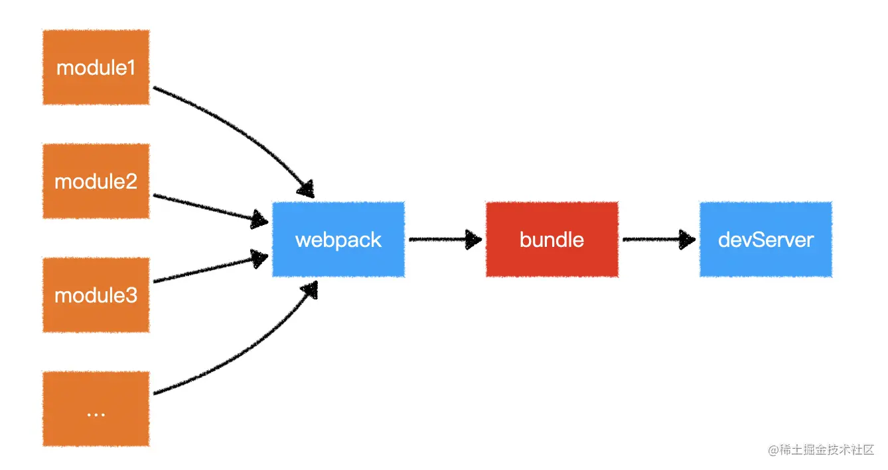
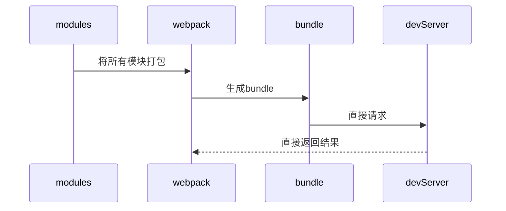
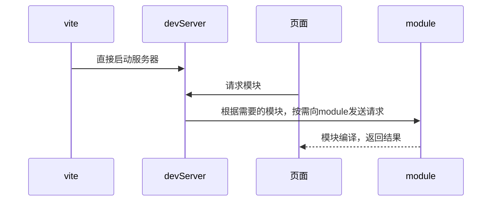

# 1.Webpack 和 vite 原理

- wepack
  

- vite
  

## 区别

- 打包原理
  vite: 基于浏览器器原生 ES Module，利用浏览器器解析 import，服务器端按需编译返回。打包基于 rollup + esbuild ，由 go 语言编写
  webpack: 先将模块统一打包成 bundle，再通过编译、解析成浏览器认识的语言。使用 babel 打包 js 语言。（也可以用 esbuild，但是很麻烦）

## 优缺点

vite

- 优点
  1. 开发环境，无需打包，快速冷启动
  2. 无需分析模块依赖，编译代码。
  3. 按需加载，不用等整个程序启动
  4. vite 基于 go 语言，纳秒级别速度
  5. 轻量快速的热重载（HMR），模块改变只需要重新请求该模块即可。而不是像 webpack 一样重新编译该模块的所有依赖
- 缺点
  1. 非现代浏览器不能运行，即浏览器要支持 ES Module 语法
  2. 不能识别 CommonJS 语法
  3. 生产环境 esbuild 构建对于 css 和代码分割不够友好
  4. 生态、插件没有 webpack 丰富
  5. 直接扔给浏览器，引入的时候，首次加载比较慢

## Webpack 构建流程

1. 初始化：启动构建，读取与合并配置参数，加载 Plugin，实例化 Compiler
2. 编译：从 Entry 出发，针对每个 Module 串行调用对应的 Loader 去翻译文件的内容，再找到该 Module 依赖的 Module，递归地进行编译处理
3. 输出：将编译后的 Module 组合成 Chunk，将 Chunk 转换成文件，输出到文件系统中
