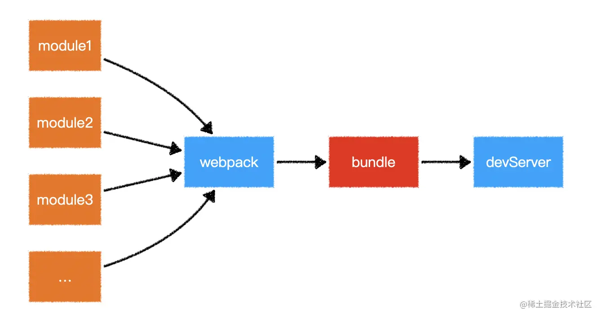
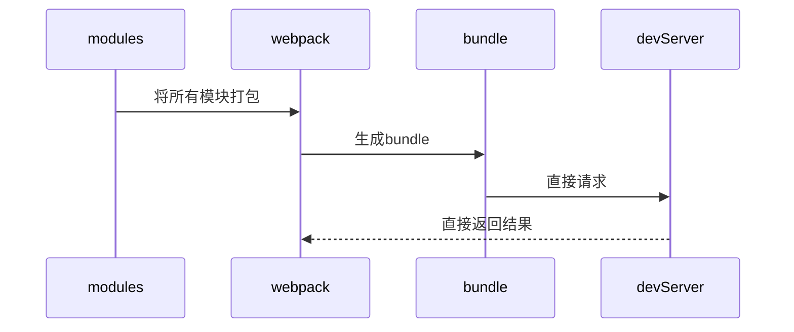
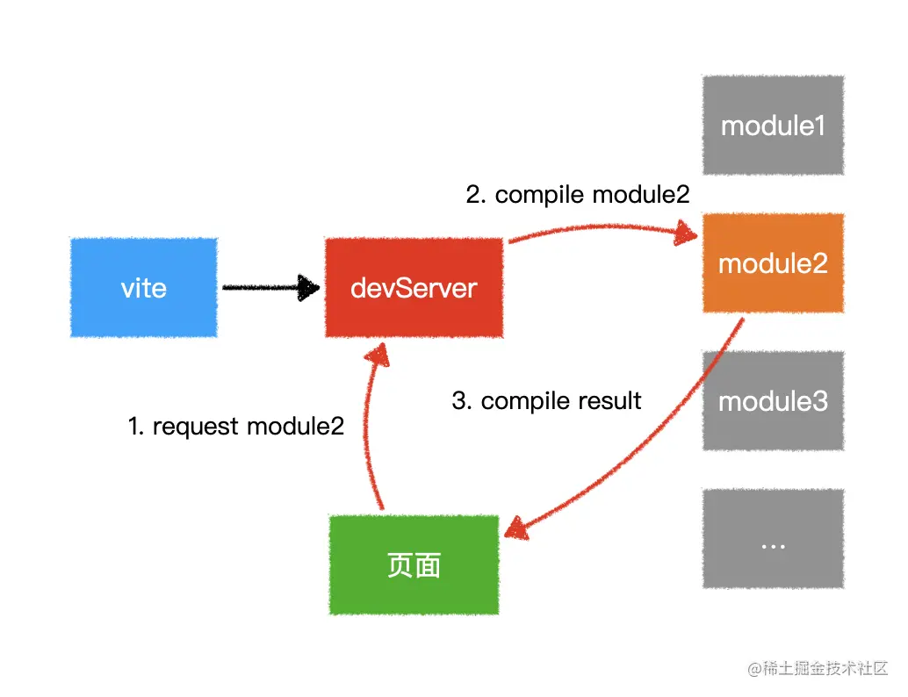
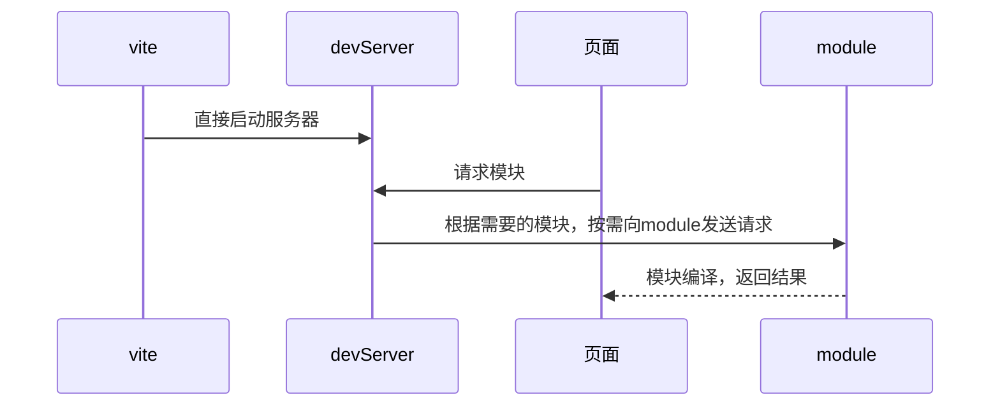

# 1.Webpack 和 vite 原理

- wepack
  

- vite
  

## 打包原理

### vite:

1. 基于浏览器器原生 ES Module
2. 所有的内容都要转成 ESM
3. 利用了浏览器器静态解析 import，服务器端按需编译返回。
4. 打包基于 rollup + esbuild ，由 go 语言编写，比 js 写的 webpack 快 100 倍
5. 不用编译，解析过程交给浏览器执行。(即浏览器通过 ESM 请求.vue文件，然后 vite 服务器在 response 返回 js 代码)
6. 在预编译阶段，会把模块下载到`/node_modules/.vite/`文件夹，然后通过相关路径引用

### webpack

1. 要把所有的模块都打成 bundle
2. 所有文件要转成 AMD 的 requireJS
3. 会引入没用到的文件

## 优缺点

vite

- 优点
  1. 开发环境，无需打包，快速冷启动
  2. 无需分析模块依赖，编译代码。
  3. 按需加载，不用等整个程序启动
  4. vite 基于 go 语言，纳秒级别速度
  5. 轻量快速的热重载（HMR），模块改变只需要重新请求该模块即可。而不是像 webpack 一样重新编译该模块的所有依赖
  6. 会有预编译阶段，类似 lodash 400 多个模块，如果不走预编译，那网页会特别卡。预编译之后，就只有一个模块了。
- 缺点
  1. 非现代浏览器不能运行，即浏览器要支持 ES Module 语法
  2. 不能识别 CommonJS 语法
  3. 生产环境 esbuild 构建对于 css 和代码分割不够友好
  4. 生态、插件没有 webpack 丰富
  5. 直接扔给浏览器，引入的时候，首次加载比较慢

## Webpack 构建流程

1. 初始化：启动构建，读取与合并配置参数，加载 Plugin，实例化 Compiler
2. 编译：从 Entry 出发，针对每个 Module 串行调用对应的 Loader 去翻译文件的内容，再找到该 Module 依赖的 Module，递归地进行编译处理
3. 输出：将编译后的 Module 组合成 Chunk，将 Chunk 转换成文件，输出到文件系统中

## 热更新的区别

### webpack
1. 先编译，在启动服务
2. 通过 webpack-dev-server 插件实现
3. 通过 socket 长链接服务，监听树形结构的依赖表。表示每个文件的依赖项。通过 文件的哈希值的变化，主动向网页推送请求。

### vite
1. 先启动服务，通过网页请求的时候，才去编译
2. 热更新的时候，让浏览器重新去发起请求。（即他是被动的）