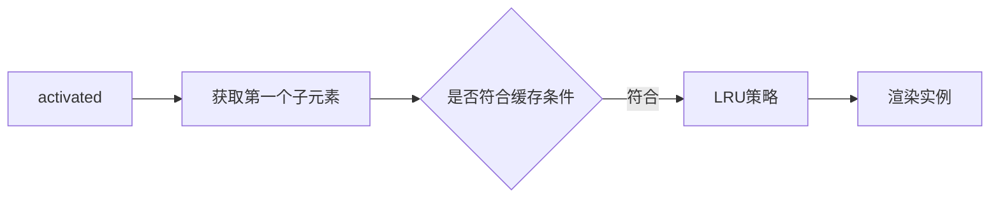

# 原理篇:2.keep-alive

## keep-alive

> 用处：由列表页面进入数据详情页面，再返回该列表页面，我们希望：列表页面可以保留用户的筛选（或选中）状态。总的来说，keep-alive 用于保存组件的渲染状态。
> keep-alive 缓存机制便是根据 LRU 策略来设置缓存组件新鲜度，将很久未访问的组件从缓存中删除。

作用：

1. 组件切换过程中将状态保留在内存中，防止重复渲染 DOM。
2. 避免反复渲染影响页面性能，减少接口请求
3. 进行路由缓存和组件缓存

### 为什么 keep-alive 标签不会生成真正 Dom 节点

1.  abstract 属性（抽象节点），根据这个属性跳过生成该实例

### 使用 LRU 机制

### Activated

> keep-alive 的模式下多了 activated 这个生命周期函数, keep-alive 的声明周期执行:

- 页面第一次进入

  - created-> mounted-> activated，当再次进入（前进或者后退）时，只触发 activated。

- 事件挂载的方法等，只执行一次的放在 mounted 中；组件每次进去执行的方法放在 activated 中。



### 基于 keep-alive 实现的缓存策略

**方案一**：整个页面缓存

```js
<keep-alive>
    <router-view v-if = "$route.meta.keepAlive"/>
</keep-alive>
<router-view v-if = "!$route.meta.keepAlive"/>
```

**方案二**：动态组件缓存

```js
<keep-alive: include = "$store.state.keepAlive.cachedView" >
    <cacheView>
    </cacheView>
</keep-alive>
```
