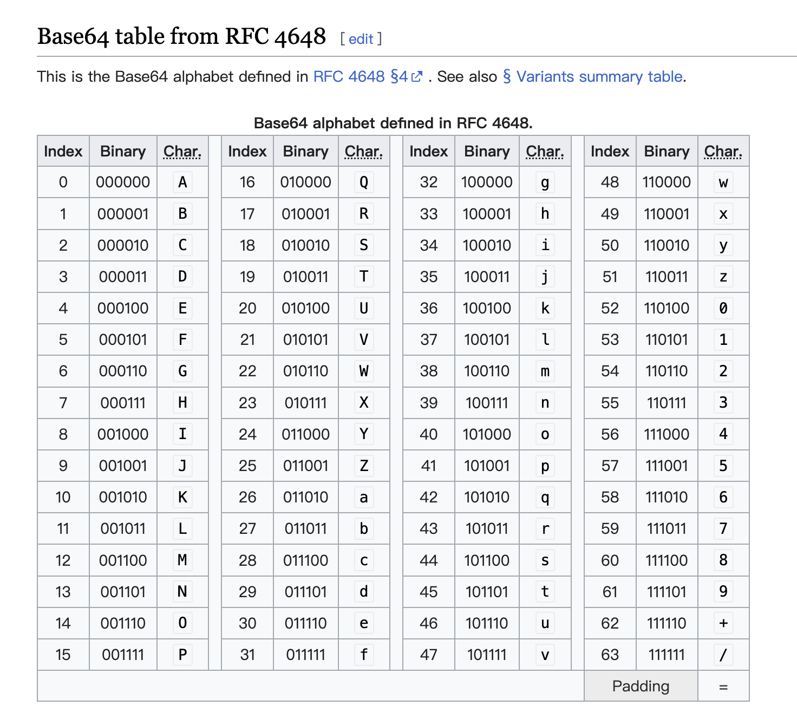

# 4. 关于 base64

## 创造base64的目的
1. 通常用于需要对二进制数据进行编码的情况
2. 更可靠，因为不存在特殊字符，都是用ASCII字符
3. 它使用64个不同的ASCII字符来表示二进制数据——大写字母 A-Z、小写字母 a-z、数字 0-9、符号 "+"、"/"（再加上作为垫字的 "="，实际上是 65 个字符，垫字是当生成的 Base64 字符串的个数不是 4 的倍数时，添加在尾部的字符），作为一个基本字符集。然后，其他所有符号都转换成这个字符集中的字符。
4. 使得二进制数据在解释成 radix-64 的表现形式后能够用 ASCII 字符串的格式表示出来
5. 为了保证数据的完整并且不用在传输过程中修改这些数据
6. 被一些应用（包括使用 MIME 的电子邮件）和在 XML 中储存复杂数据时使用。

## base64 为什么会比原来的文件大 33%
eg. abc => YWJj

1. ASCII 码字符占 8 位二进制，而 Base64 占 6 位，取最小公倍数即为 24，即可以用 4 个 base64 字符去表示 3 个 ASCII 码字符。
2. 