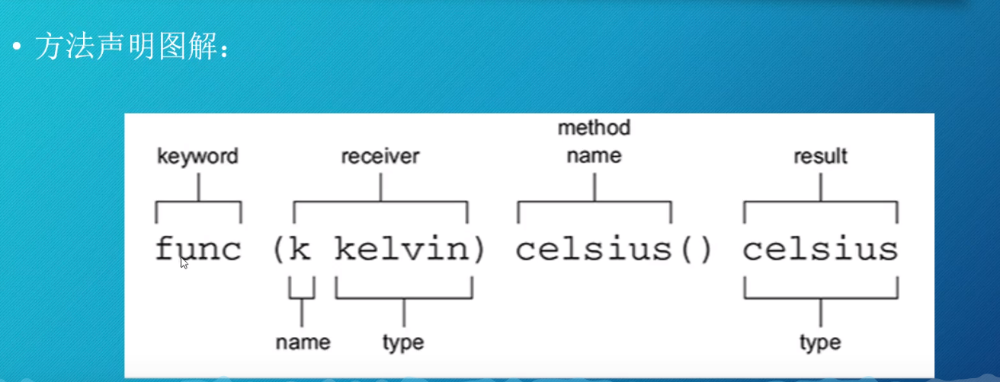
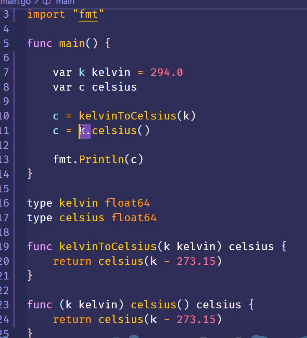

# 2.Go的方法和函数

- tips: 与JS不同，Go中方法和函数的调用方式是不一样的。不像TS中方法和函数是一样，可以直接调用。

## 函数(Function)
```go
func functionName(parameters) returnType { ... }
```

```ts
function functionName(parameters) returnType { ... }
```

## 方法(Method)
1. 方法是在结构体（struct）上定义的函数，通过为结构体定义方法，可以在该类型的实例上调用这些方法。
2. 方法需要指定一个接收者（receiver），可以是值类型或指针类型，用来绑定方法到特定类型的实例。
3. 方法可以有多个参数，但是只能有一个接收者
4. 接收者可以是值类型或指针类型，用来绑定方法到特定类型的实例
5. 方法通常用于实现面向对象编程中的行为，而函数则可以用于各种其他目的。s
6. 调用： receiver.methodName


```go
func (receiver Type) methodName(parameters) { ... }
```

```ts
function methodName(parameters) { ... }
class someType {
}
const typeInstance = new someType();
typeInstance.methodName(parameters);

```