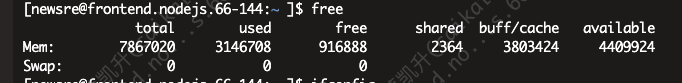

# 2.Linux

## 常见命令

- mkdir

  - （英文全拼：make directory）命令用于创建目录。
  - 参数：-p 确保目录名称存在，不存在的就建一个。

- vim
  - https://www.runoob.com/linux/linux-vim.html
- rsync
  - 文件同步
  - 在本地计算机与远程计算机之间，或者两个本地目录之间同步文件
  - 参数：-r 必须
- mv
  - 重命名/复制文件到某个区域
  - mv abcd 1234 abcd 重命名为 1234
  - mv abcd a/1234 abcd 移动到 a 文件夹下面，并且命名为 1234
- ls
  - 参数：
    -a 显示所有文件及目录 (. 开头的隐藏文件也会列出)
    -l 除文件名称外，亦将文件型态、权限、拥有者、文件大小等资讯详细列出
- clip
  - 复制文本


## 系统维护

### systemd

- 杀死一个服务的所有子进程
```sh
$ sudo systemctl kill apache.service
```

- 立即启动一个服务
```sh
$ sudo systemctl start apache.service
```

- 显示系统状态
```sh
$ systemctl status
```

- 列出正在运行的 Unit
```sh
$ systemctl list-units
```

### 查看cpu、内存、ip相关信息
- 查看内存
```sh
free -h
```

1. Buffers/Cache（缓存/缓冲区）：被用作缓存的内存量。这部分内存通常会被系统用来加快访问速度，但如果系统需要更多内存来运行应用程序时，它会被释放。
2. swap memory：如果系统开始使用交换空间（Swap），表示物理内存不足。频繁的交换会导致性能下降，因此需要注意监控交换空间的使用情况。
3. Free Memory（空闲内存）：系统当前可用的空闲内存。过低的空闲内存可能会导致系统变慢或出现内存不足的问题。

- ip
```sh
ifconfig 
```

- cpu
- 
```sh
# 查看 cpu 多少核
lscpu 
```

```sh
# 查看 cpu 当前哪些消耗性能最多（shift + p 进行排序）
top
```
1. top 直接查看所有的（shift+p 按cpu排序，shift+M 按内存排序）
2. top -p pid（进程id）