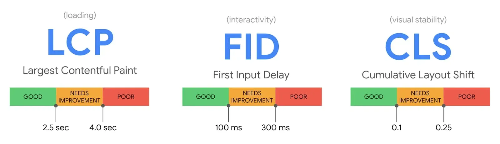

# 16.Web前端性能优化
> 关键 API: MuationObserver, MessageChannel, web Worker
## 三个重要指标: 加载, 交互, 视觉稳定性



<!-- 详情见:[优化指标](..) -->

### 单页应用与多页应用不同

用户请求一个页面时，页面会先加载 index.html，加载完成后，就会触发 DOMContentLoaded 和 load。
而这个时候，页面展示的只是个空白页。此时根本不算真正意义的首屏。
接下来，页面会加载相关脚本资源并通过 axios 异步请求数据，使用数据渲染页面主题部分，这个时候首屏才渲染完成。

## FMP 的度量

FMP（First Meaning Paint）：首次有效绘制，标记主角元素渲染完成的时间点，主角元素可以是视频网站的视频控件，内容网站的页面框架也可以是资源网站的头图等。

> MutationObserver 监控 DOM 元素 。
> 当 DOM 元素发生变化时，程序会标记变化的元素，记录时间点和子元素数量，存储到数组中

1. new 一个实例: MutationObserver
2. 根据 getBoundingClientRect 和 innerHeight 判断是否在可视区域
3. 借助这个找出 3s 内 Dom 包含元素最多, 变化最大的元素
4. 计算出 FMP 时间

## FPS 的度量

### 通过 requestAnimationFrame 计算

核心原理: requestAnimationFrame 会在页面每次重绘后被调用，也就是每一帧画面都对应一次 requestAnimationFrame 的调用，所以只需要统计在 1S 内，requestAnimationFrame 调用的次数，就可以得出在这一秒内的 FPS 数值了。

# 使用一些工具分析

## TAM / PageSpeed / 浏览器自带的 Performance insight

# 优化的角度

## 发送请求时

1. 避免重定向(每次重定向都有耗时)
2. Dns 预解析

```html
<!--  第一步：首先打开DNS预解析 -->
<meta http-equiv="x-dns-prefetch-control" content="on" />
<!--  第二步：手动添加解析 -->
<link rel="dns-prefetch" href="//www.img.com" />
<!-- 静态资源域名（如CDN）\未来即将会发生跳转的域名\会重定向的域名 -->
```

3. 预连接

```html
<link rel="preconnect" href="//example.com" />
<link rel="preconnect" href="//cdn.example.com" crossorigin />
```

4. 预加载(让浏览器在空闲时提前获取)
   1. Preload\preload\prefetch

## 运行时

1. 滚动优化(防抖节流)
2. 长列表优化
   1. 分页
   2. 分片
   3. 虚拟列表(有第三方库)
3. 避免 JS 运行时过长
   1. 可以使用 MessageChannel 实例对大任务进行切片(腾讯文档做法)
4. 懒加载(setTimeout, requestIdleCallback 放到后面的事件循环或者空闲时间)
5. 使用 web Worker,对 CPU 密集型的计算进行优化
6. 利用渲染时候的{合成层}
   1. 合成层的位图，会交由 GPU 合成，比 CPU 处理要快；（transform）
   2. 父元素使用 will-change, 如果子元素使用动画的话
7. 使用 CSS 元素
   1. contain: strict(特定的 DOM 元素和它的子元素，让它们能够独立于整个 DOM 树结构之外。它能够让浏览器有能力只对部分元素进行重绘、重排，而不必每次针对整个页面)
   2. content-visibility(允许我们推迟我们选择的 HTML 元素渲染)
8. dom 离线（脱离文档流，再恢复）
   1. display：none
   2. createDocumentFragment
   3. 通过在需要操作的节点上创建副本，然后在副本上进行操作，最后进行替换（DOM.replaceChild）
   4. 如果不脱离文档流，对文档的每一步操作都有可能导致重绘或者重排，但是使用离线 dom 操作可以让操作完成之后只产生一次重排。

## 静态资源优化

1. 字体优化

   1. 使用第三方库{font-spider-plus}, 只加载需要使用到的字体图标
   2. 将字体转为 base64, 设置在 src 属性里面

2. JS 体积优化(压缩, babel, webpack)
3. 代码分割
   1. 中小型项目按{依赖}分包
   2. 大型项目按基础库+引用次数分包
4. CSS 优化
   1. 关键 CSS 内联(优先显示与当前用户操作有关的内容, Critical Rendering Path，即 CRP)
   2. 谨慎使用 @import() (会把你的请求变得串行化)
5. 图片优化
   1. 使用 svgo 压缩 svg 图片
   2. webp / avif. (使用 CDN 静态存储)
   3. 可以在想要动图效果时使用视频，通过静音（muted）的 video 来代替 GIF
6. 动静分离
   1. 将静态资源放到 nginx 中，动态资源转发到 tomcat 服务器
   2. 通过反向代理服务器进行缓存，代理服务器可以直接进行处理，不用传给后端服务器
   3. 静态技术架构：CDN、nginx、squid/varnish
   4. 静态页面访问路径短，访问速度快，几毫秒
   5. 动态页面访问路径长，访问速度相对较慢(数据库的访问，网络传输，业务逻辑计算)，几十毫秒甚至几百毫秒，对架构扩展性的要求更高
   6. 静态页面与动态页面以不同域名区分

## 缓存

1. CDN 缓存
   1. DNS 解析将 CDN 资源的(CName)解析到 CDN 负载均衡器, 负载均衡器选择地理位置近, 负载低的机器提供服务
   2. 缓存：缓存是把资源（COS）复制到 CDN 服务器里
   3. 回源：资源过期/不存在就向上层服务器（COS）请求并复制到 CDN 服务器里
2. CDN 容灾(由于各地理位置用户网络环境等原因，存储在 CDN 上的资源会出现加载失败的情况，导致部分静态资源加载失败)
   1.
3. CDN 回源
   1. 通过 webpack 构建之后，生成对应文件名自动带上对应的 MD5 值。如果文件内容改变的话，那么对应文件哈希值也会改变，对应的 HTML 引用的 URL 地址也会改变，触发 CDN 服务器从源服务器上拉取对应数据，进而更新本地缓存。
   2. 降低 CDN 的使用成本
   3. 降低资源加载时间，更低的回源率代表更多用户是访问到了缓存
4. CDN 优化
   1. 开启 HTTP2.0: 解决一个域名只使用一个 TCP 长连接和消除队头阻塞问题
   2. 图片压缩
   3. 开启 Gizp / Brotli
5. 反向代理服务器缓存

   1. 缓存服务器将多个相同请求，直接返回。
   2. 需要 HTTP 协议进行支持

      1. Expires：HTTP1.0 规范
      2. Cache-control：HTTP1.1 规范
      3. If-Modified-Since/Last-Modeified(时间戳可能不匹配)

         1. 分布式服务
         2. 精度只到秒级

      4. ETag/If-Node-Match

## 控制浏览器并发

疑问：为什么浏览器会控制请求并发数在 6 个左右？
答：

1. 对客户端的端口资源考虑：一个 TCP 占用一个端口，避免端口被消耗殆尽
2. 因为线程池不共享，过多并发的频繁切换导致客户端性能问题
3. 避免同一客户端大量请求超过服务端的并发阈值
4. 防止客户端两个应用抢占资源，导致弱势方永远处于阻塞状态。

## 服务端渲染

### Hydration

1. 服务端通过 renderToString 直出 HTML。

2. 浏览器下载所有相关的 JS，包括框架运行时代码、组件代码等。

3. 解析和执行 JS。

4. 构建出完整的渲染树，将渲染树和真实 DOM 关联匹配，并为 DOM 绑定事件。

上述的第四个阶段称为水合（Hydration），SSR 应用要面临的一个问题是随着页面的复杂性上升，Hydration 时间也会越来越长，在 Hydration 结束前页面都是不可交互的。

### Island 架构

当一个页面中只有部分的组件交互，那么对于这些可交互的组件，我们可以执行 hydration 过程，因为组件之间是互相独立的。
而对于静态组件，即不可交互的组件，我们可以让其不参与 hydration 过程，直接复用服务端下发的 HTML 内容。 可交互的组件就犹如整个页面中的孤岛(Island)，因此这种模式叫做 Islands 架构。

### 边缘计算（ESR）

将页面进行**动静拆分**。
将**静态内容缓存在 CDN 先快速返回给用户**，然后在边缘计算节点上发起动态内容的请求，之后将动态内容与静态部分以流的形式进行拼接，从而进一步提高了用户的首屏加载时间。
尤其在边缘地区或者弱网环境也有能拥有很好的用户体验，此外还减少原先 SSR 服务器压力。
