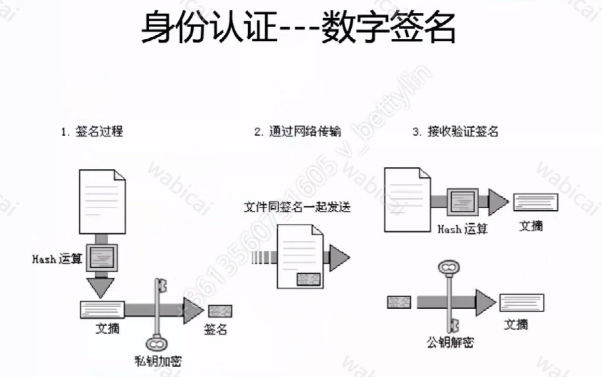

# 18.HTTPS原理及最佳实践

- HTTPS = HTTP + TLS(SSL)
- TLS 是 SSL 经过组织协议之后的版本。TLS 目前包括 TLS1.2（2008 年更新）TLS1.3（2018 年更新）
- TLS1.2 需要 2 个 rtt，TLS1.3 需要 0 个 rtt，极大的加快了速度。

## HTTP 为什么需要握手？

1. 身份认证-防冒充
2. 数据加密-防窃听
3. 数据防篡改-防篡改

## 身份认证-证书

### 作用

1. 校验签名
2. 传递公钥

### 非对称加密

公钥加密，私钥解密。
客户端请求证书 =》 服务器
服务器发送证书 =》 携带公钥 A、证书 =》 客户端
客户端 =》 通过公钥 A 加密一个数据 a，校验证书 =》 客户端
服务器 =》 通过私钥解密数据 a

# 流量劫持和监控

> HTTPS 是解决链路劫持的核武器！

### DNS 劫持（域名劫持）

#### 如何攻击

1. 本机 DNS 劫持
   攻击者通过某些手段使用户的计算机感染上木马病毒，或者恶意软件之后，恶意修改本地 DNS 配置，比如修改本地 hosts 文件，缓存等
2. 路由 DNS 劫持
   很多用户默认路由器的默认密码，攻击者可以侵入到路由管理员账号中，修改路由器的默认配置
3. 攻击 DNS 服务器
   直接攻击 DNS 服务器，例如对 DNS 服务器进行 DDOS 攻击，可以是 DNS 服务器宕机，出现异常请求，还可以利用某些手段感染 dns 服务器的缓存，使给用户返回来的是恶意的 ip 地址

#### 如何防御

1. 准备两个域名，随时切换
2. 预埋 ip 地址，拿不到正确回包的时候直接发起 ip 请求
3. DNS over HTTPS
   1. 在 TLS 协议之上传输 DNS 内容。
4. DNS over HTTP
   1. 用 HTTP 协议来传输 DNS。
5. DNS over HTTPS
   1. 用 HTTPS 协议来传输 DNS
      > 一般使用 http-dns 绕过运营商解析域名，达到防止 DNS 劫持的目的.

### 不能解决的问题

1. 客户端木马、问题
2. 只能处理在传输层的问题
3. 中间人攻击也没办法

# HTTPS 性能优化

## HTTPS 存在的问题

> 为什么现在还有 54%不支持 HTTPS？

## 慢

1. 移动端慢 500ms 以上

### TCP 协议优化

- fast open
  <!--  -->

### 应用层协议优化

1. HSTS 减少 302 跳转
   <!--  -->

2. 采用 HTTP2.0
   1. HTTP1.x 是串行链路。
   2. HTTP2.0 支持【多路复用】、【头部压缩】、【server push】

### 密钥计算加速

1. RSA 算法对整体性能影响 75%
2. 优化方案（减少完全握手）
   1. 分布式 session cache
   2. 全局 session ticket
   3. 自定义 session ticket
3. RSA 异步代理计算

###

## 贵

1. 服务器成本：HTTPS 性能不到 HTTP 1/10
2. 证书：价格不一、容易过期、申请复杂

# HTTPS 证书和部署问题
