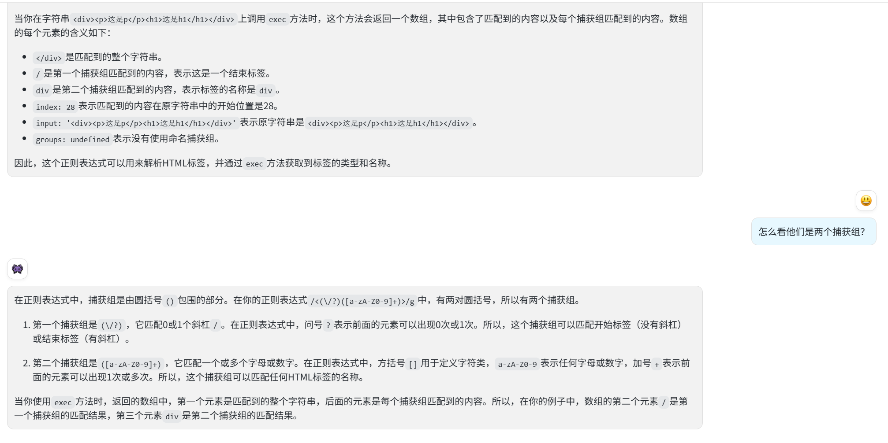

# 6.从括号匹配聊到HTML解析器和状态机

> tips: 本文默认读者已经掌握基本数据结构知识。
> 基于TypeScript解法

## 括号匹配
> 原题：[有效的括号](https://leetcode.cn/problems/valid-parentheses/description/) 
### 问题描述
给定一个只包括 '('，')'，'{'，'}'，'['，']' 的字符串 s ，判断字符串是否有效。

有效字符串需满足：

1. 左括号必须用相同类型的右括号闭合。
2. 左括号必须以正确的顺序闭合。
3. 每个右括号都有一个对应的相同类型的左括号。

示例 1：
> 输入：s = "()"
> 输出：true

示例 2：
> 输入：s = "()[]{}"
> 输出：true

示例 3：
> 输入：s = "(]"
> 输出：false
>

### 括号匹配：哈希表+栈
最常见解法，时间复杂度O(n),空间复杂度O(n)
```ts
function isVaild(str){
    const map = new Map();
    map.set(")", "(")
    map.set("]", "[")
    map.set("}", "{")

    const stack = [];
    for (let i of s) {
        if (map.has(i)) {
            const current = stack.pop();
            if (current !== map.get(i)) return false;
        } else {
            stack.push(i);
        }
    }
    return stack.length === 0;
}
```
> 面试官：现实情况肯定很复杂，比如`HTML解析器`。要求匹配`<div></div>`,这种情况该怎么解决

## HTML解析器
- tips:从本质上来讲，括号匹配和标签匹配是同种类型，都是要验证括号/标签是否符合规则。
## 问题描述
> 给定一个HTML字符串，输出解析后的DOM树,
> 1. 字符串只考虑普通标签，不考虑自闭合标签 如: ``
> 2. 只考虑普通标签，如p,span,div
> 3. 字符串一定符合HTML规范
> 示例：
> 输入：`<div><p>这是p</p><h1>这是h1</h1></div>`
> 输出：
> ```js
>    {
>       tag: 'div',
>       content: '',
>        children: [
>            {
>                tag: 'p',
>                content: '这是p',   
>                children: []
>            },
>            {
>                tag: 'h1',
>                content: '这是h1',
>                children: []
>            }
>        ]
>    }
>   ```
### HTML解析器(简单版本): 正则表达式+栈
思路：
1. 通过正则表达式exec函数，匹配出`标签名`和`标签所在index`。
2. 遇到开标签入栈，闭标签出栈。
3. 标签内容通过index截取。
4. 
```ts
function parseHTML(html){
    function createNode(tag, content, children){
        return {
            tag,
            content,
            children
        }
    }
    let match = null;
    let root = createNode('root','',[]);
}
const html = '<div><p>这是p</p><h1>这是h1</h1></div>';
console.log(parseHTML(html));
```

### HTML解析器（参考自htmlparser2库）：状态机
> htmlparser2源码：[htmlparser2](https://github.com/fb55/htmlparser2)
```ts
class HTMLNode {
    constructor(type, content = '') {
        this.type = type;
        this.content = content;
        this.children = [];
    }
}

class HTMLDocumentParser {
    constructor(htmlString) {
        this.htmlString = htmlString;
        this.documentRoot = new HTMLNode('document');
        this.nodeStack = [this.documentRoot];
        this.parserState = this.dataState;
    }

    parseHTML() {
        for (let char of this.htmlString) {
            this.parserState = this.parserState(char);
        }
        return this.documentRoot;
    }

    dataState(char) {
        if (char === '<') {
            return this.openTagState;
        } else {
            this.emitNode('text', char);
            return this.dataState;
        }
    }

    openTagState(char) {
        if (char === '/') {
            return this.openEndTagState;
        } else {
            this.emitNode('startTag', char);
            return this.tagNameState;
        }
    }

    tagNameState(char) {
        if (char === '>') {
            this.emitNode();
            return this.dataState;
        } else {
            this.currentNode.content += char;
            return this.tagNameState;
        }
    }

    openEndTagState(char) {
        this.emitNode('endTag', char);
        return this.endTagNameState;
    }

    endTagNameState(char) {
        if (char === '>') {
            this.emitNode();
            return this.dataState;
        } else {
            this.currentNode.content += char;
            return this.endTagNameState;
        }
    }

    emitNode(type = '', content = '') {
        if (type) {
            this.currentNode = new HTMLNode(type, content);
        } else {
            let topNode = this.nodeStack[0];
            if (this.currentNode.type === 'startTag') {
                this.nodeStack.unshift(this.currentNode);
                topNode.children.push(this.currentNode);
            } else if (this.currentNode.type === 'endTag') {
                if (topNode.content !== this.currentNode.content) {
                    throw new Error("Tag start end doesn't match!");
                } else {
                    this.nodeStack.shift();
                }
            } else {
                if (this.currentNode.content.trim() !== '') {
                    topNode.children.push(this.currentNode);
                }
            }
        }
    }
}

let htmlString = `<div>
  <h1>这是h1</h1>
  <p>这是p</p>
  <div>
    这是div
    <h2>h2</h2>
  </div>
</div>`;

let documentParser = new HTMLDocumentParser(htmlString);
let documentRoot = documentParser.parseHTML();
console.error('documentParser', documentParser);
console.log(JSON.stringify(documentRoot, null, 2));
```