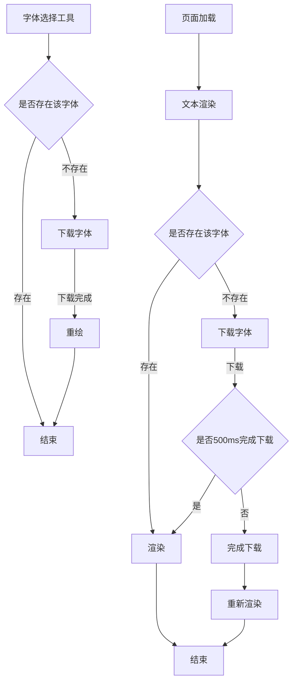

字体选择工具不做字体预览
显示用到字体时进行下载
font-display
https://developer.mozilla.org/zh-CN/docs/Web/CSS/@font-face/font-display 
auto：使用浏览器默认的行为；
block：浏览器首先使用隐形文字替代页面上的文字，并等待字体加载完成再显示；
swap：如果设定的字体还未可用，浏览器将首先使用备用字体显示，当设定的字体加载完成后替换备用字体；
fallback：与 swap 属性值行为上大致相同，但浏览器会给设定的字体设定加载的时间限制，一旦加载所需的时长大于这个限制，设定的字体将不会替换备用字体进行显示。 Webkit 和 Firefox 中设定此时间为 3s；
optional：使用此属性值时，如果设定的字体没有在限制时间内加载完成，当前页面将会一直使用备用字体，并且设定字体继续在后台进行加载，以便下一次浏览时可以直接使用设定的字体

