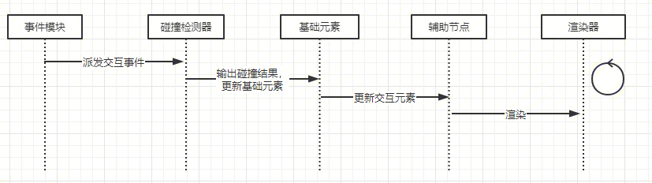

# 事件处理流程

1. 事件模块：负责统一注册和分发事件。

2. 碰撞检测器：交互类事件与元素之间的碰撞检测。

3. 基础元素：包括线，文本，图形，图片等

4. 辅助节点：包括连线锚点，拖动点，旋转点，元素工具栏，选框，选取，右键

# 事件模块
1. 统一注册

2. 抽象语义化事件（如onCopy, onUndo, onSelectAll等）

3. 需要支持多实例

### 事件分类
|事件类型|说明	 |作用    |
| :-----| ----: | :----: |
|tap事件	    |单击事件，与pan事件，press事件互斥	                            |选择拖动点，锚点，元素|
|pan事件	    |拖动事件，鼠标或者手指按压移动产生，与tap事件互斥，支持识别方向   |	区域选择，拖动元素位置，改变元素大小
|press事件	    |按压事件，触发press，pressup事件，与tap事件互斥	            |特定的交互
|move事件	    |鼠标移动事件，与pan事件区别在于，move事件不需要鼠标按压移动	  |光标位置同步，扫描元素（元素hover态）
|pinch事件	    |捏合事件，在移动端中使用	                                    |
|keyboard	    |键盘事件，包括复制，粘贴，删除，全选，撤销，恢复等	              |支持快捷键功能
|wheel事件	    |滚轮事件	                                                   |画布缩放，蓝图缩放
|message事件	|消息事件，需要支持多实例	                                    |负责与iframe，worker通信
|contextmenu    |鼠标右键	                                                  |显示右键菜单

### 碰撞检测器
|检测层级|	说明|
| :-----| ----: | :----: |
|Active层	|当元素进入激活态的时候渲染的dom（文本编辑，网页浏览，视频播放），工具栏，右键等|
|辅助节点层	|连线锚点，拖动点，旋转点|
|元素层	|基础元素|
|画布层	|最底层，绘制选取|