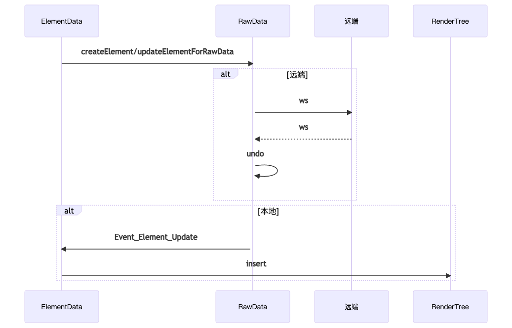
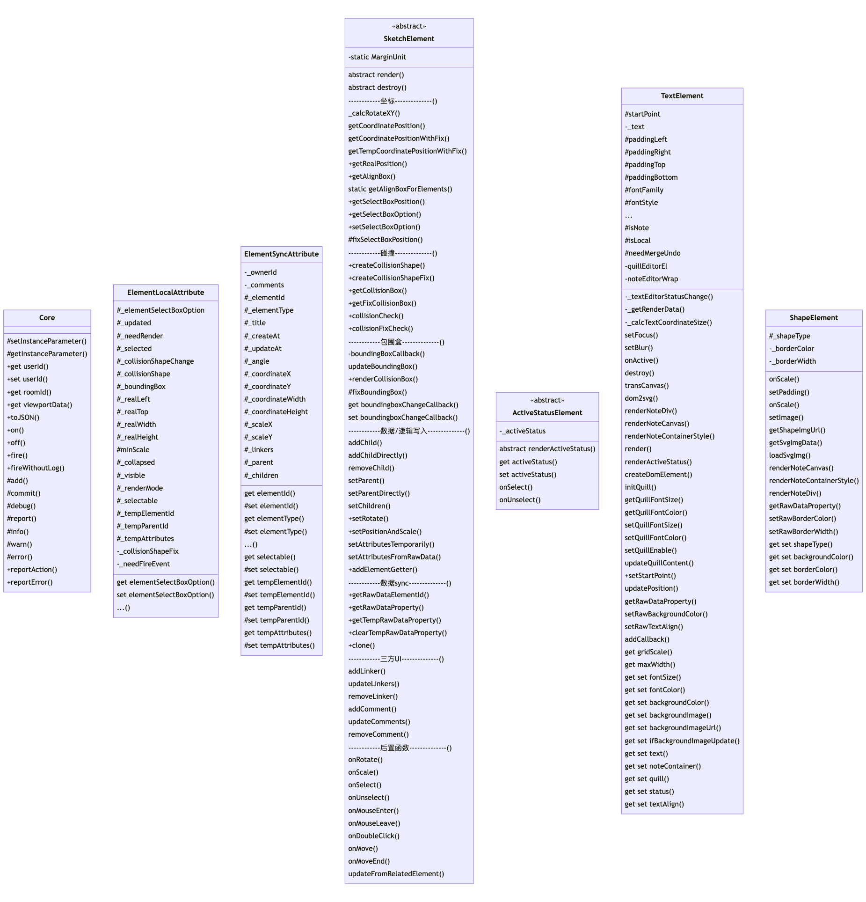

## 公共API通过接口实现
问题背景：元素基类API随意添加，未分组未注释，代码冗余

解决办法：增加接口interface，后续公共API先在接口中声明，再在基类中实现；

带来的好处：

1. 元素基类的公共API高质量实现，减少重构成本。
2. 类似API接口文档容易理解，开发成本降低。

## 通过工厂函数来新建元素实例
问题背景：实例化各元素类的代码耦合在交互逻辑类中

解决办法：抽离实例化各元素类的代码，封装工厂函数。

带来的好处：

1. 不在交互逻辑中暴露元素创建的代码
2. 放在工厂类符合组合式API原则，方便统一的逻辑复用、加日志、权限控制等

## 元素数据流向

## 元素对象继承关系

