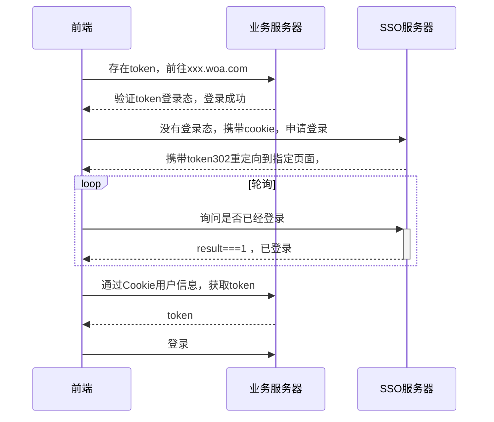

# 什么是SSO

# 怎么实现SSO单点登录？
- 两种方式：重定向、JSONP
> 以xxx.woa.com为例子，该例子为重定向方案

```mermaid
sequenceDiagram
前端 ->> 业务服务器: 存在token，前往xxx.woa.com
业务服务器 -->> 前端: 验证token登录态，登录成功
前端 ->> SSO服务器: 没有登录态，携带cookie，申请登录
SSO服务器 -->> 前端: 携带token302重定向到指定页面，
loop 轮询
    前端 ->>+ SSO服务器: 询问是否已经登录
    SSO服务器 -->>- 前端: result===1 ，已登录
end
前端 ->> 业务服务器: 通过Cookie用户信息，获取token
业务服务器 -->> 前端: token
前端 ->> 业务服务器: 登录

```