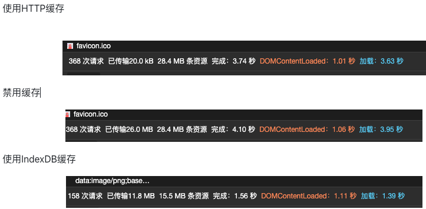

# 优化-使用 IndexDB 解决 Svga 重复加载问题

- IndexDB 特点：

  - 键值对存储：采用对象仓库存储数据，所有类型的数据都可以存储，主键唯一。
  - 异步操作：操作采用异步的方式，防止大量的数据操作影响页面性能。
  - 支持事务：要么全部成功，要么全部失败。
  - 同源限制：不能跨域访问。
  - 存储量大：大小取决于硬件，一般不少于 250M。
  - 支持二进制：支持二进制存储。

# 现存问题

## 一：重复加载

1. 以送礼 BP 为例
2. 每层闪光的 svga 元素都会重复进行 XMLHttpRequest 请求，请求 Svga 文件。然后再把 Svga 解析为 base64 格式
3. base64 资源无法缓存

4. 某些机型偶现 Svga 资源太大，加载时间很长。
5. 之前出现过 CDN 劫持，导致 Svga 加载失败，影响业务逻辑

## 二、解决方案

- 目标一：重复加载

1. 送礼 bp、showBp 很多 svga 资源是固定的。
2. 首次进入的时候，缓存请求的资源，并存入 IndexDB 中，第二次请求相同链接直接返回该资源。
3. 后续访问页面，相同链接地址的 svga 资源，直接从 IndexDB 读取。 9. 设置 IndexDB 过期时间，每次访问该资源，都进行更新，超过时间进行删除。（LRU 策略）

- 目标二：加载失败

1. 加载成功的 Svga 资源，提取第一帧图片存放在 IndexDB 中，作为后续加载失败的代替图。（如：之前都能加载成功，后续因为 CDN 劫持等原因导致资源无法展示问题）

# 三、任务拆解

1. 核心代码
   基本逻辑：
2. 只有一个数据库，分不同的 Store: "Svga" 和 " Image"
3. 暴露一个数据库实例，外界直接引入
4. Svga 资源在 Store"Svga"，以 "xxxxx.svga": "xxxxx.svga" 格式存储
5. Image 资源在 Store"Image"，以 "xxxxx.svga": "xxxxx.png" 格式存储

> 这里使用 promisify 封装，将 IndexDB 的异步，改为类似同步的方式。减少外界对 IndexDB 的关注，使用体验类似 localStorage。

```js
// 数据库实例
const TABLE_NAME_SVGA = "SVGA";
const TABLE_NAME_IMAGE = "IMAGE";
const DB_NAME = "TCS_DB";

// 数据库实例
let _dbInstance = null;

function promisify(request) {
  return new Promise((resolve) => {
    request.onsuccess = () => resolve(request.result);
    request.onerror = () => {
      console.error("indexDB error", request);
      resolve(request.error);
    };
  });
}
function handleUrlKey(url) {
  return url.split("/").pop();
}
/**
 * IndexedDB 数据库对象
 * 判断浏览器是否支持
 * */
const IndexedDB =
  window.indexedDB ||
  window.webkitIndexedDB ||
  window.mozIndexedDB ||
  window.msIndexedDB;
if (!IndexedDB) {
  console.error("浏览器不支持IndexedDB");
}
class DBStorage {
  constructor(dbName) {
    if (!IndexedDB) {
      return null;
    }
    const request = indexedDB.open(dbName);
    request.onupgradeneeded = function (event) {
      let DB = event.target.result;
      // 存放Svga
      if (!DB.objectStoreNames.contains(TABLE_NAME_SVGA)) {
        const table = DB.createObjectStore(TABLE_NAME_SVGA, {
          keyPath: "url",
        });
        table.createIndex("url", "url", { unique: true });
      }
      // 存放Svga的第一帧图片
      if (!DB.objectStoreNames.contains(TABLE_NAME_IMAGE)) {
        const table = DB.createObjectStore(TABLE_NAME_IMAGE, {
          keyPath: "url",
        });
        table.createIndex("url", "url", { unique: true });
      }
    };
    this.dbPromise = promisify(request);
  }

  async transactionWrite(storeName) {
    const db = await this.dbPromise;
    return db?.transaction([storeName], "readwrite").objectStore(storeName);
  }
  async transactionRead(storeName) {
    const db = await this.dbPromise;
    return db?.transaction([storeName], "readonly").objectStore(storeName);
  }

  async addItem(storeName, value) {
    try {
      const transaction = await this.transactionWrite(storeName);
      return promisify(transaction?.add(value));
    } catch (e) {
      console.error("indexDB error", e);
      return Promise.resolve();
    }
  }
  async readItem(storeName, key) {
    try {
      const transaction = await this.transactionWrite(storeName);
      return promisify(transaction?.get(key));
    } catch (e) {
      console.error("indexDB error", e);
      return Promise.resolve();
    }
  }
  /**
   * @description 添加svga资源
   * @param url
   * @param source Svga解析后的数据
   */
  async addSvga({ url, source }) {
    return await this.addItem(TABLE_NAME_SVGA, {
      url: handleUrlKey(url),
      source,
    });
  }

  /**
   * @description 获取svga资源
   * @param url string
   * @returns {Object} 资源
   */
  async getSvga(url) {
    const res = await this.readItem(TABLE_NAME_SVGA, handleUrlKey(url));
    return res?.source;
  }

  /**
   * @description 添加img资源
   * @param url
   * @param source 可以是base64或者或者Url
   */
  async addImage({ url, source }) {
    return await this.addItem(TABLE_NAME_IMAGE, {
      url: handleUrlKey(url),
      source,
    });
  }

  /**
   * @description 获取svga第一帧图片
   * @param url string
   * @returns {String} base64格式图片
   */
  async getImage(url) {
    const res = await this.readItem(TABLE_NAME_IMAGE, handleUrlKey(url));
    return res?.source;
  }
}
if (!_dbInstance) {
  _dbInstance = new DBStorage(DB_NAME);
  if (!_dbInstance.dbPromise) {
    _dbInstance = null;
  }
}
export default _dbInstance;
```

五、效果

