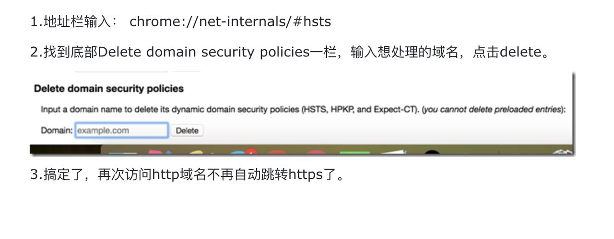
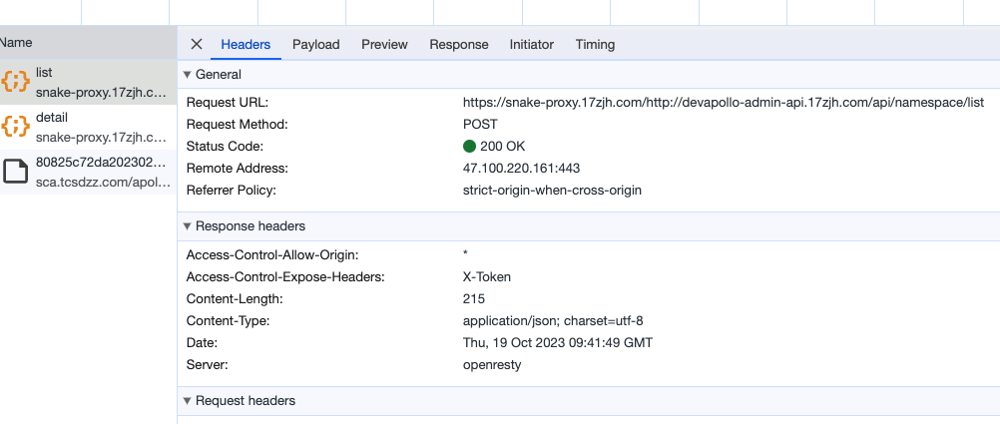

# 开发-https 网站兼容

## 背景

1. 使用 chrome 浏览器的有时候会默认把 http 网站转了为 https 网站，导致网站请求错误。
2. 公司很多对内网站接口 api 采用的 ip 或者域名没有设置 https 正式。
3. 网站 url 支持 https
4. 在使用的 http 网站的时候，浏览器自动转了 https，但是接口是 http 或者不支持 https，接口就会报错

## 解决方案

### 修改浏览器配置

1.地址栏输入： chrome://net-internals/#hsts 2.找到底部 Delete domain security policies 一栏，输入想处理的域名，点击 delete。
configadmin.17zjh.com 3.搞定了，再次访问 http 域名不再自动跳转 https 了。


缺点：
用户操作，每个用户需要操作一次

### 每个不支持 https 的接口都进行证书支持

优点：
最优解
缺点：
业务接口较多，支持起来成本大

### https 代理转发

```js
const BaseHttpsProxyUrl = "https://snake-proxy.17zjh.com/";
export const setHttpsProxy = (url?: string) => {
  if (!url) return url;
  if (url?.indexOf("https:") !== -1) return url;
  if (url?.indexOf("http:") === -1) url = `http:${url}`;
  return `${BaseHttpsProxyUrl}${url}`;
};

const { token, domain } = await defHttp.post({
  url: setHttpsProxy("http://devapollo-admin-api.17zjh.com/api/namespace/list"),
  params: {
    type: fileType,
  },
});

// 最终会变成。https://snake-proxy.17zjh.com/http://devapollo-admin-api.17zjh.com/api/namespace/list
```


优点：
不需要业务接口进行改造
缺点

1. 需要项目进行统一改造
2. 代理可能带了多余消耗
