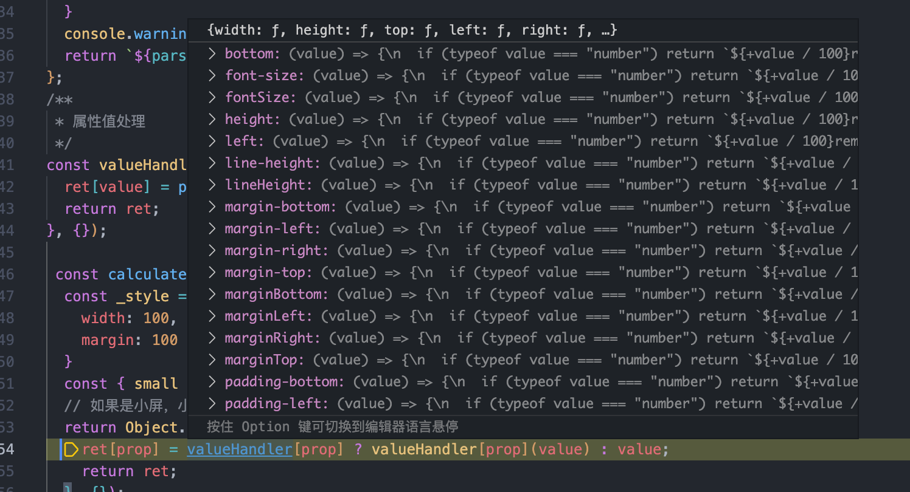

# 开发-低代码平台中的属性值处理函数

## 将 100 转为 1rem

### 核心代码



```js
const SIZE_PROPS = [
  "width",
  "height",
  "top",
  "left",
  "right",
  "bottom",
  "marginTop",
  "marginLeft",
  "marginRight",
  "marginBottom",
  "paddingLeft",
  "paddingTop",
  "paddingRight",
  "paddingBottom",
  "fontSize",
  "lineHeight",
  "margin-top",
  "margin-left",
  "margin-right",
  "margin-bottom",
  "padding-left",
  "padding-top",
  "padding-right",
  "padding-bottom",
  "font-size",
  "line-height",
];

export const parseUnit = (value) => {
  if (typeof value === "number") return `${+value / 100}rem`;
  if (typeof value === "string") {
    return /^[\d-]*$/.test(value) ? `${+value / 100}rem` : value;
  }
  console.warning("Illegal value:", value);
  return `${parseInt(value) || 0}rem`;
};
/**
 * 属性值处理
 */
const valueHandler = SIZE_PROPS.reduce((ret, value) => {
  ret[value] = parseUnit;
  return ret;
}, {});
export const calculateStyle = (style) => {
  if (!style) return {};
  const { small = {}, ...rest } = style;
  // 如果是小屏，小屏幕的属性覆盖
  return Object.entries(isSmallScreen ? { ...rest, ...small } : rest).reduce(
    (ret, [prop, value]) => {
      ret[prop] = valueHandler[prop] ? valueHandler[prop](value) : value;
      return ret;
    },
    {}
  );
};
```

## 转化表达式

### 核心代码

```js
/**
 * 计算表达式的值
 * @param {*} keys
 * @param {*} values
 * @param {*} exp
 * @returns
 */
export function calculateExpression(keys, values, exp) {
  console.log({
    keys,
    values,
    exp,
  });
  const newExp = Array.isArray(exp) ? `[${exp.join(",")}]` : exp;
  try {
    const fn = new Function(
      ...keys,
      `try {return ${newExp} } catch (e) {console.log(e);return undefined}`
    );
    return fn.apply(this, values);
  } catch {
    return "undefined";
  }
}
```
