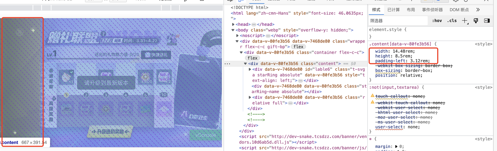
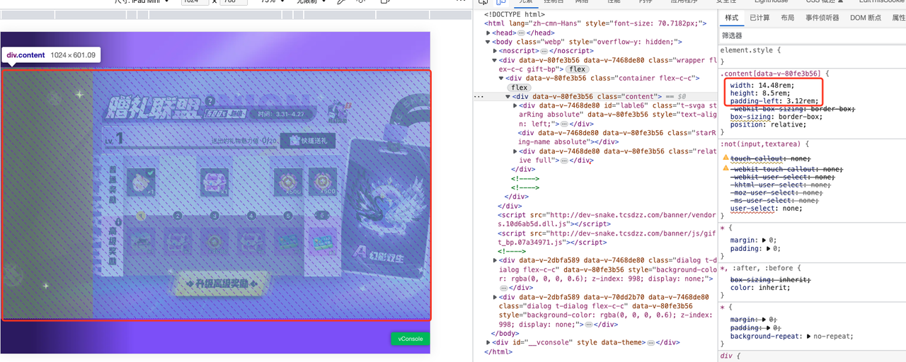
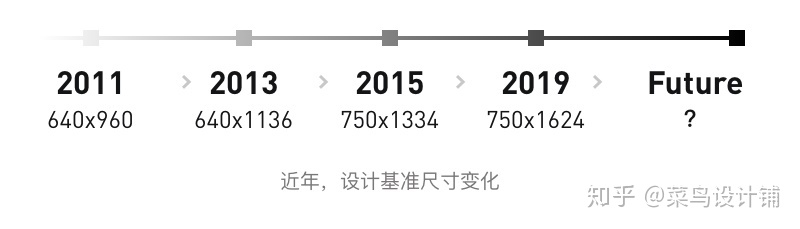

# 开发-移动端机型适配方案

## 基础思路

1. 与设计师提前确定设计稿尺寸
2. 根据设计稿背景图，设置 background
3. 预留左侧安全区区域，开发样式基于左侧 Tab 进行开发
4. 使用 rem 代替 px，100px = 1rem
5. 图片尺寸使用 2 倍尺寸

## 实现

### 确定设计稿尺寸

1. 规定背景图片展示区域尺寸为：1624 \* 750（iphoneX 尺寸）
2. 实际开发过程中
   1. 背景图宽度固定为 1624，高度一般为 1217（4:3 比例，适配平板）
   2. 设置 wrapper 为 100vw，100vh，占满整个屏幕
   3. wrapper 子元素：container 设置背景图，使用 contain，确保展示区域能全部展示。
   4. 窄屏手机，宽度填满，高度会有部分在 wrapper 以外

### 设置背景图

16.24rem , 12.17 为背景图自己的宽高 ，即设置背景的宽高与图片相同

```html
<html>
  Wrapper.flex-c-c Container.gift-bp(:hasMask="true", :isFinish="isFinish")
</html>
<style>
  .wrapper
    width: 100vw;
    height: 100vh;
    display: flex;
    justify: center;
    align-item: center;

  .container
  background: url(img/bg.bc88b85a.png) center/contain no-repeat;
  width: 16.24rem;
  height: 12.17rem;
  background-size: 16.24rem 12.17rem;

  .gift-bp
  color #fff
  font-size .24rem >>> .container
  background url('./img/bg.png') center no-repeat
  background-size: 16.24rem 12.17rem;
  weight: 16.24rem;
  height: 12.117rem;
  position: relative;
</style>
```

### 预留左侧安全区区域

1. 规定左侧安全区（即二级 Tab）为：312px
2. 如图：
   1. designWidth: 14.48rem; designHeight: 8.5rem;
   2. 即需要展示的内容保证在 container（1448\*850 尺寸）里面
3. 原则上，保证 x 轴方向上填充满，y 轴方向固定为 850px，可以有一部分溢出或者隐藏。
   1. height 没有完全展示：
      
   2. height 溢出
      
      4、rem 代替 px

```js
const maxWidth = 1624;
export function setFontSize(designWidth = 1448, designHeight = 750) {
const minAspectRatio = designHeight / maxWidth;
// 网页可见区域宽
let clientWidth = document.documentElement.clientWidth || document.body.clientWidth || window.innerWidth || window.screen.width
// 网页可见区域高
const clientHeight = document.documentElement.clientHeight || document.body.clientHeight || window.innerHeight || window.screen.height
// 设备纵横比
const deviceAspectRatio= clientHeight / clientWidth
// 设计纵横比
let designAspectRatio = designHeight / designWidth;
// 横屏
if (deviceAspectRatio < 1) {
if (deviceAspectRatio < minAspectRatio) {
// 宽比 maxWidth 还宽，宽屏，例如 ipad
designWidth = maxWidth
} else if (deviceAspectRatio < designAspectRatio) {
clientWidth = clientHeight / designAspectRatio
}
}
window.clientWidth = clientWidth

const fontSize = 100 \* ( clientWidth / designWidth) ;
window.**REM_FONTSIZE** = fontSize;

document.documentElement.style.fontSize = `${fontSize}px`;
}

// 使用：定稿为 1448px
setFontSize(1448)
```

例如，如果客户端可视区域宽度为 724px，设计稿宽度为 1448px，则计算出的根元素字体大小为 50px（即 (724 / 1448) \* 100）。这样设置后，14.48rem，即表示手机上宽度填满，从而实现不同手机的展示效果跟设计稿一样。
至于为什么 minAspectRatio，取 750/1624，详见：https://zhuanlan.zhihu.com/p/335539390


