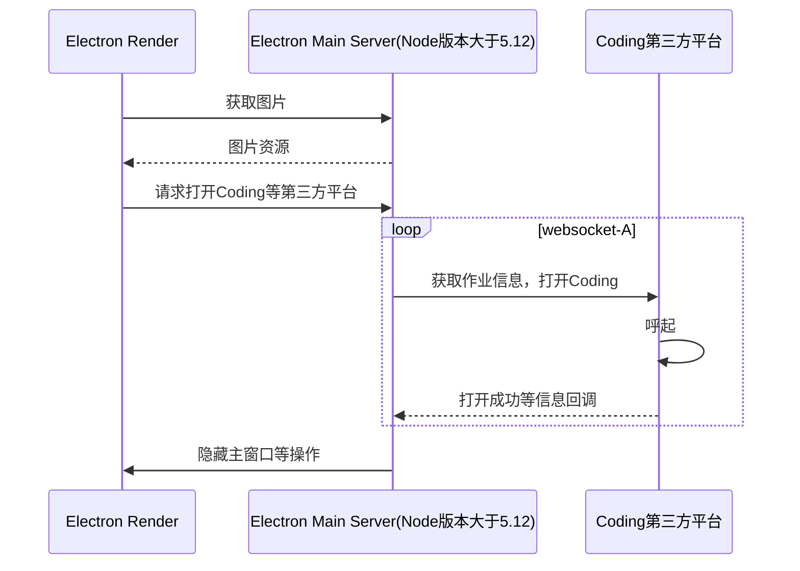
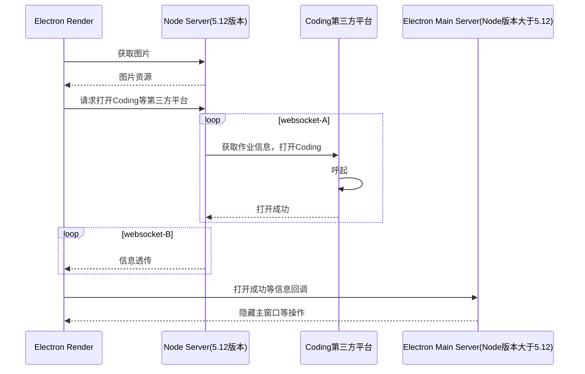
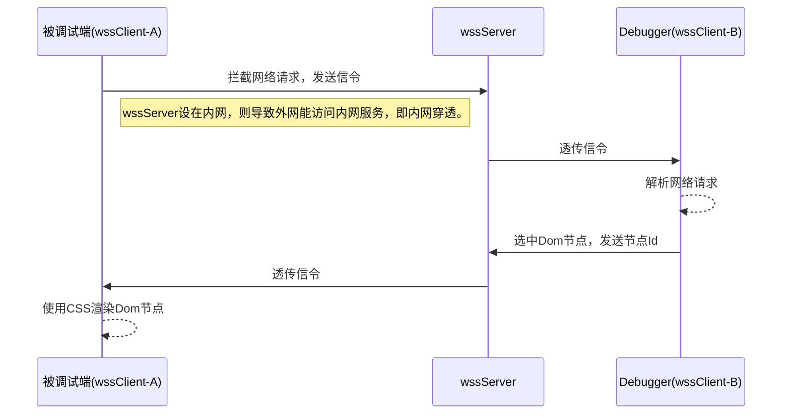

# 1.electron xp 适配

```mermaid
sequenceDiagram
  Electron Render ->> Electron Main Server(Node版本大于5.12) : 获取图片
  Electron Main Server(Node版本大于5.12) -->>  Electron Render : 图片资源
  Electron Render ->> Electron Main Server(Node版本大于5.12) : 请求打开Coding等第三方平台
  loop websocket-A
    Electron Main Server(Node版本大于5.12) ->> Coding第三方平台: 获取作业信息，打开Coding
    Coding第三方平台 ->> Coding第三方平台: 呼起
    Coding第三方平台 -->> Electron Main Server(Node版本大于5.12): 打开成功等信息回调
  end
  Electron Main Server(Node版本大于5.12) ->> Electron Render: 隐藏主窗口等操作
```

```mermaid
sequenceDiagram
  Electron Render ->> Node Server(5.12版本) : 获取图片
  Node Server(5.12版本) -->>  Electron Render : 图片资源
  Electron Render ->> Node Server(5.12版本) : 请求打开Coding等第三方平台
    loop websocket-A
        Node Server(5.12版本) ->> Coding第三方平台: 获取作业信息，打开Coding
        Coding第三方平台 ->> Coding第三方平台: 呼起
        Coding第三方平台 -->> Node Server(5.12版本): 打开成功
    end
    loop websocket-B
        Node Server(5.12版本) -->> Electron Render: 信息透传
    end
  Electron Render ->> Electron Main Server(Node版本大于5.12): 打开成功等信息回调
  Electron Main Server(Node版本大于5.12) -->> Electron Render: 隐藏主窗口等操作
```

```mermaid
sequenceDiagram
    被调试端(wssClient-A) ->> wssServer : 拦截网络请求，发送信令
        Note left of wssServer: wssServer设在内网，则导致外网能访问内网服务，即内网穿透。
    wssServer ->> Debugger(wssClient-B) : 透传信令
   Debugger(wssClient-B) -->> Debugger(wssClient-B) : 解析网络请求
   Debugger(wssClient-B) ->> wssServer : 选中Dom节点，发送节点Id
    wssServer->> 被调试端(wssClient-A)  : 透传信令
    被调试端(wssClient-A) -->> 被调试端(wssClient-A) : 使用CSS渲染Dom节点
```
