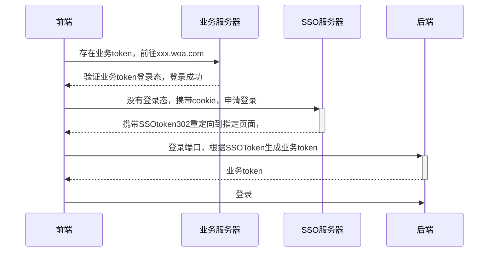
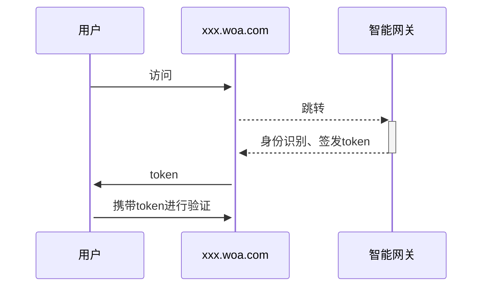
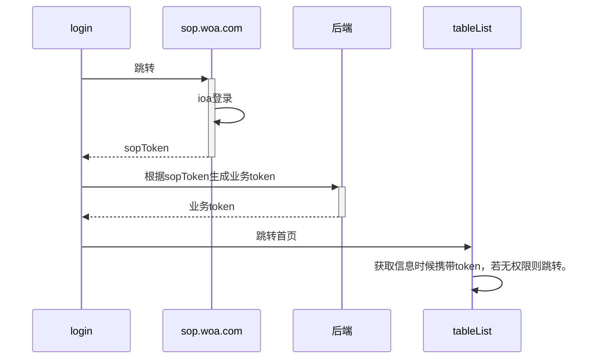
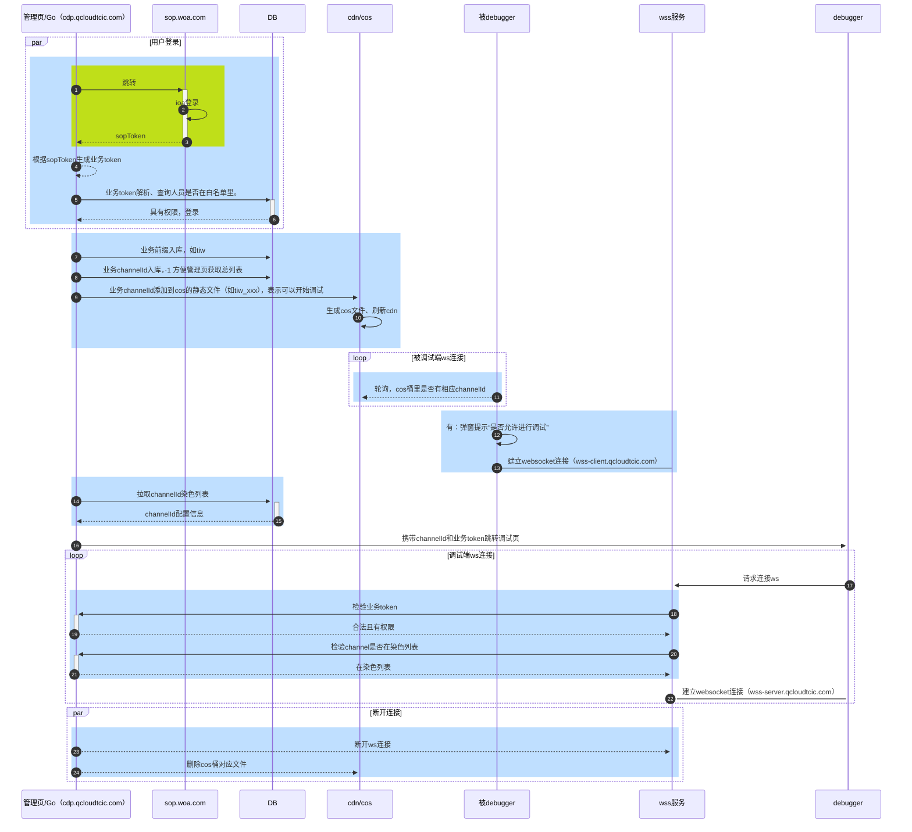
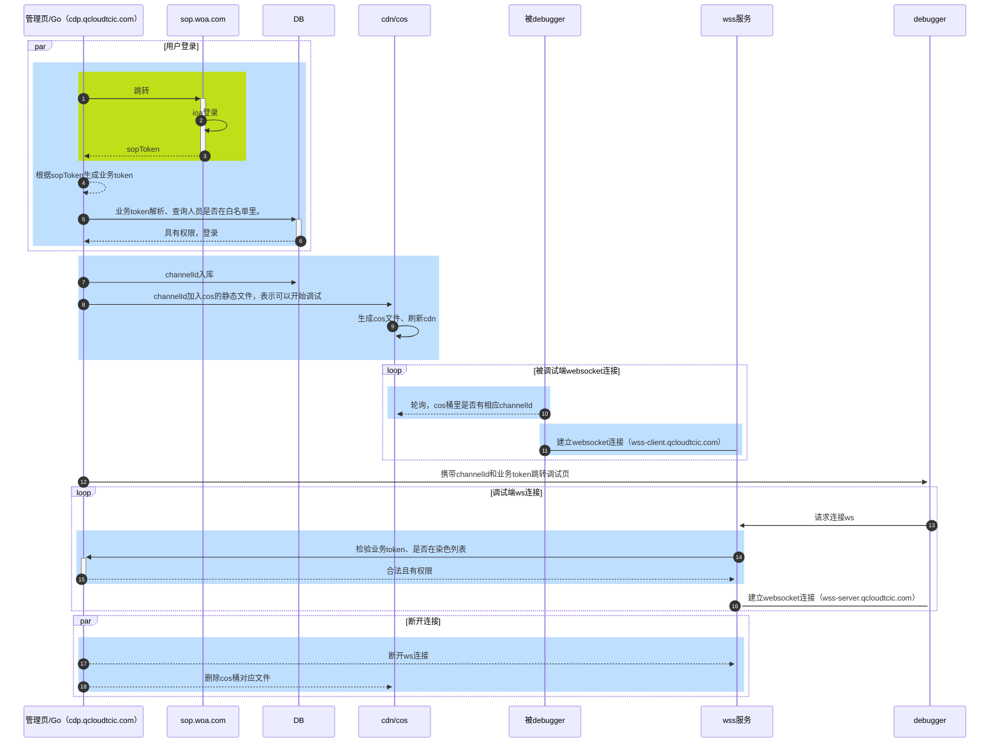

# 2.远程调试

## 登录方式

### 鹰眼目前的登录方式

### ioa 登录

### 远程调试登录逻辑

## 远程调试流程图

## 调试流程图

#### 说明

1. 整个流程只在绿色部分与内网进行交互，其他地方全部部署外网。
2. wss 连接策略
   1. ~~上下行 wss 没有进行通信 10 分钟之后自动断开两端的 wss 连接~~。（后续考虑加入）
   2. 30 秒发送一次心跳，确保占用连接资格。30 秒没发送之后，如果有其他的频道连接，会被挤掉。
   3. 染色暂时是统一在控制页进行取消染色操作。
   4. 没有手动删除染色的情况下，wss 可以一直连接.

### 简化图

