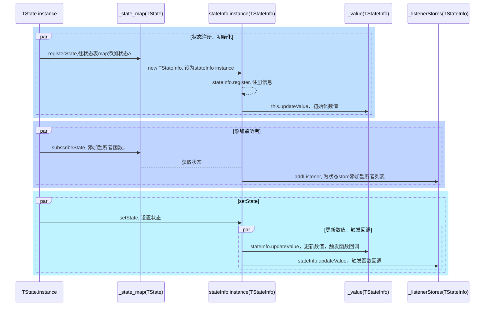

```mermaid
sequenceDiagram
rect rgb(191, 223, 255)
    par 状态注册、初始化
        TState.instance ->> _state_map(TState): registerState,往状态表map添加状态A
        _state_map(TState) ->> stateInfo instance(TStateInfo): new TStateInfo, 设为stateInfo instance
        stateInfo instance(TStateInfo) -->> stateInfo instance(TStateInfo) : stateInfo.register, 注册信息
        stateInfo instance(TStateInfo) ->> _value(TStateInfo) : this.updateValue，初始化数值
    end
end
rect rgb(191, 213, 255)
    par 添加监听者
        TState.instance ->> _state_map(TState): subscribeState, 添加监听者函数，
        _state_map(TState) --> stateInfo instance(TStateInfo) : 获取状态
        stateInfo instance(TStateInfo) ->> _listenerStores(TStateInfo): addListener, 为状态store添加监听者列表
    end
end
rect rgb(191, 243, 255)
    par setState
        TState.instance ->> stateInfo instance(TStateInfo) : setState, 设置状态
        par 更新数值，触发回调
            stateInfo instance(TStateInfo) ->> _value(TStateInfo) : stateInfo.updateValue，更新数值，触发函数回调
            stateInfo instance(TStateInfo) ->> _listenerStores(TStateInfo) : stateInfo.updateValue，触发函数回调
        end
    end
end
```