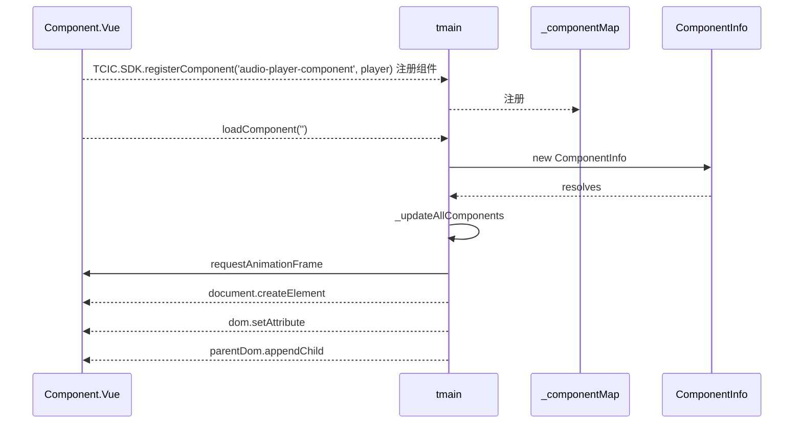

# 5.loadComponent

```mermaid
sequenceDiagram
    Component.Vue -->> tmain : TCIC.SDK.registerComponent('audio-player-component', player) 注册组件
    tmain -->> _componentMap: 注册
    Component.Vue -->> tmain : loadComponent('')
    tmain ->> ComponentInfo: new ComponentInfo
    ComponentInfo -->> tmain : resolves
    tmain ->> tmain : _updateAllComponents
    tmain ->> Component.Vue: requestAnimationFrame
    tmain -->> Component.Vue: document.createElement
    tmain -->> Component.Vue: dom.setAttribute
    tmain -->> Component.Vue: parentDom.appendChild
```
