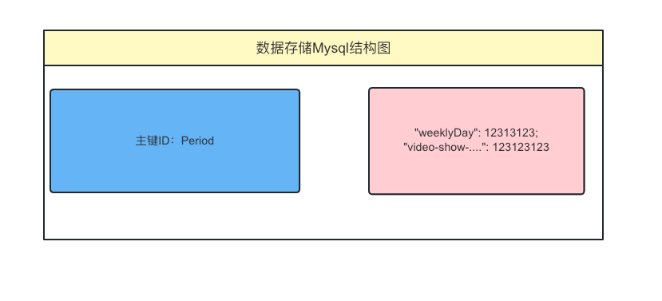
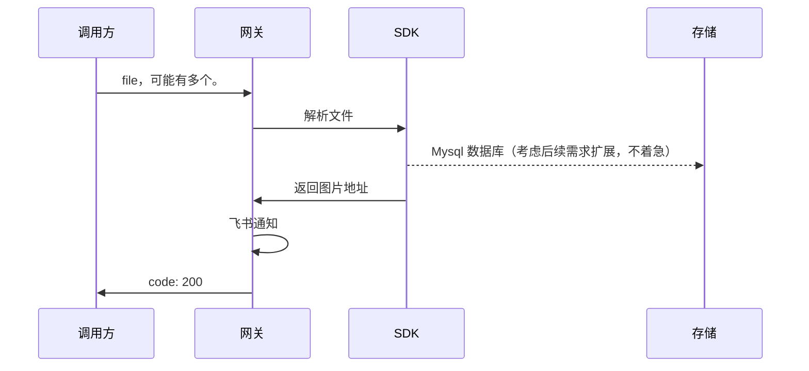

# 6.非结构化数据展示

## protocol

### 1. 文件传入格式

```json
{
  "period": "1.18-1.25",
  "weeklyDau": {
    "name": "周均日活",
    "data": 123123
  },
  "averageDau": {
    "name": "日活",
    "data": 123123
  },
  "video": {
    "name": "奖励视频",
    "data": {
      "show": {
        "name": "展示",
        "data": 123123
      },
      "eCPM": {
        "name": "eCPM",
        "data": 123123
      }
    }
  }
}
```

### 2.mysql 存储格式



## sequenceDiagram


